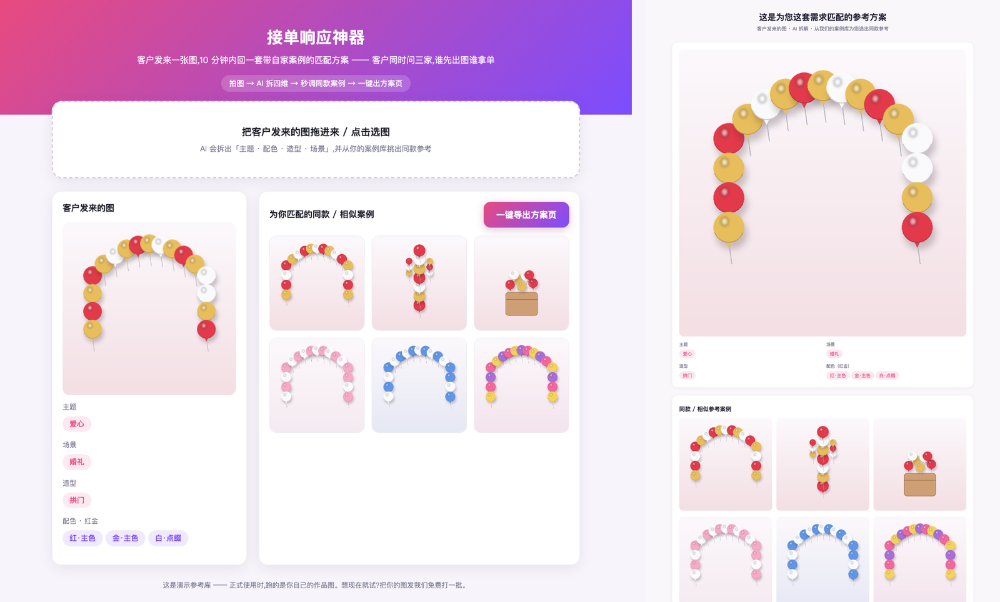

# studio-asset-library

[](https://github.com/zhangleo-1983/studio-asset-library/actions/workflows/ci.yml)

面向小型工作室的多模态素材库:上传作品图,AI 按行业词表自动打标,
按标签快速找到相似案例,并生成方案页发给客户。

Multimodal asset library for small studios — AI tagging with pluggable
industry vocabularies, tag-based case retrieval, and shareable proposal pages.

> **项目状态:早期版本,接口可能变化,参见 [CHANGELOG](CHANGELOG.md)。**



*示例包演示:上传一张图 → AI 拆出标签 → 召回相似案例 → 一键导出方案页。图中素材均为程序绘制的插画。*

## 它解决什么问题

小工作室(装饰、花艺、家装等)积累了大量作品图,散落在手机相册和微信聊天里。
客户来询价时,很难快速找到几张相似的案例拿给他看。
本项目把"整理素材"变成自动打标,把"找案例"变成按标签检索。

## 现在能做什么

以下每一项都已实现,并有对应的测试(或可运行的验证命令):

- **AI 自动打标**:调用通义千问视觉模型(Qwen-VL,经阿里云百炼)给作品图打标签,原始输出原样留存,标签带完整溯源(模型、提示词版本、词表版本、输入哈希)。
  代码 `app/tagging/`;可用 `make smoke` 以你自己的 key 验证真实调用(见 [docs/SMOKE.md](docs/SMOKE.md))。
- **受词表约束的维度 + 自由文本维度**:受约束维度的模型输出会归一化到词表里的词(支持别名),词表外的词记为「待归类」进入复核;自由文本维度按原词形保存。
  代码 `app/tagging/normalize.py`。
- **入库去重**:按内容哈希去重,软删除后可恢复。代码 `app/assets.py`。
- **复核与人工修正**:复核队列(低置信度、待归类、模型标记存疑的标签),人工可新增、改值、删除、恢复标签,全过程留痕、可追溯。代码 `app/review.py`、`app/corrections.py`。
- **按标签召回相似案例**:上传一张新图,按标签重合度(维度加权,权重由行业包配置)从案例库召回同款/相似案例。**这是标签匹配,不是以图搜图。** 代码 `app/demo/recall.py`。
- **方案页导出**:把上传图、拆出的标签和召回的案例图渲染成单文件 HTML(可直接打印为 PDF)。代码 `app/demo/export.py`,演示页 `app/demo/`。
- **行业包切换**:分类体系、提示词、界面文案、演示数据集都放在可替换的行业包里,改一项配置切换。代码 `app/packs.py`,测试 `tests/test_packs.py`。
- **多租户数据隔离**:每张表、每次查询都带租户号,缺少租户上下文的查询会被拒绝。测试 `tests/test_tenant_isolation.py`。

## 快速开始

### 一键体验(Docker)

只需要 [Docker](https://www.docker.com/products/docker-desktop/)(Docker Desktop 或 OrbStack)。用示例包和确定性的假模型跑通全流程,**无需任何密钥**:

```bash
git clone https://github.com/zhangleo-1983/studio-asset-library.git && cd studio-asset-library
docker compose --profile demo up --build demo
```

看到日志里出现 `demo 图库种子完成` 和 `Uvicorn running` 后,浏览器打开 **http://localhost:8100** :上传一张图 → 拆标签 → 召回相似案例 → 导出方案页。
结束后 `Ctrl+C` 停止;想清掉数据库:`docker compose --profile demo down -v`。

> 第一次会下载并构建镜像,需要几分钟。演示页里的图都是程序绘制的插画;这里的"打标"用的是假模型,想验证真实的 Qwen 调用见下面的 `make smoke`。

### 验证真实模型调用

有自己的百炼 API key 时运行 `make smoke`(需要 Docker;零基础逐步说明见 [docs/SMOKE.md](docs/SMOKE.md))。
它会在独立的一次性环境里用真实 Qwen 给 3 张示例图打标,逐项检查,并用错误 key 反向验证不会悄悄退回假数据。

### 本地开发

前置:PostgreSQL 15(本机可连)、Python 3.11、[uv](https://docs.astral.sh/uv/)。

```bash
uv venv --python 3.11 && uv pip install -e ".[dev]"

createdb asset_library                                   # 建库(本机 PostgreSQL;连接串按需调整)
export DATABASE_URL="postgresql+psycopg2://localhost:5432/asset_library"
export INDUSTRY_PACK=balloon      # 完整示例包;make demo 系列目标默认也用它

make migrate                      # 建表结构
DEMO_MOCK=1 make demo-seed        # 生成演示素材 + 入库 + 打标(mock provider)
make demo-web                     # 演示页 http://localhost:8100
make demo                         # 打标闭环演示:上传→入库→打标→复核→修正
make test                         # 核心测试 + 每个行业包自带的测试
```

## 部署

部署**全部在 Docker Compose 里完成**(迁移在 api 容器启动时自动执行,种子用 `docker compose exec` 在容器内执行),宿主机上只需要 Docker 和你的行业包目录。
部署默认 `INDUSTRY_PACK=template`(空骨架),需要先写好自己的行业包(复制 `packs/template/`,按其 `FIELDS.md` 填写,见下节),再指向它:

```bash
export INDUSTRY_PACK=<你的行业包 id>       # packs/ 下的目录名;行业包会随镜像一起构建
docker compose up -d --build                # api(启动时自动 alembic upgrade head)/ worker / postgres
docker compose exec api assetlib-seed --tenant-id 1 --slug my_studio --display-name "My Studio"   # 词表取自所选行业包
curl http://localhost:8000/healthz          # {"status":"ok"}
```

注意:compose 目前**不传入 `DASHSCOPE_API_KEY`**,worker 是占位(无密钥时空转,不处理打标任务);批量打标请先用"本地开发"方式,或自行扩展 compose。

## 行业包

行业相关的一切——分类体系(维度 + 词表)、带槽位的提示词、界面文案、演示数据集——都在 `packs/<id>/` 里,核心代码与行业无关;
随仓库提供完整示例包 `balloon` 和空骨架 `template`。机制、字段说明与新增行业的步骤见 [docs/industry-packs.md](docs/industry-packs.md)。

## 已知局限

请在使用前了解:

- **只支持标签检索。** 检索靠规范化标签表 + 多维筛选;**以图搜图(向量/语义相似)在规划中,目前没有**。
- **维度键固定为 5 个**(`structure` / `color` / `scene` / `theme` / `color_scheme`)。行业包可以从中选用、替换词表和展示名,但**不能自定义新的维度**(数据库约束按这 5 个键设计,自定义维度需要新的迁移,尚未实现)。见 [docs/industry-packs.md](docs/industry-packs.md)「已知限制」。
- **主题、配色简称是自由文本维度,不受词表约束。** 模型怎么写就怎么存,可能出现**同义不同写**(如"红白黄"与"红白黄色")。只有受词表约束的维度(示例包里是造型、配色、场景)才保证标签是词表里的词。检索、统计时不要假设自由文本维度的取值是有限集合。
- **示例包的演示素材是程序绘制的插画,不是真实照片。** 在插画上的打标结果**不代表**在真实照片上的准确率;`make smoke` 冒烟测试**只验证流程与规范**(标签在词表内、来源是真实调用、提示词版本正确),**不评估准确率**。准确率请用你自己的图另行评估。

## 定制与合作

如果你是工作室经营者、不想自己部署,也可以直接联系我们代为搭建。

需要为你的行业定制行业包、部署或接入现有业务,
邮箱 zhangliang@getbitbeats.com,微信 zhangleo。

## 许可

本项目以 [GNU AGPL-3.0](LICENSE) 发布。商业授权请联系 zhangliang@getbitbeats.com。
